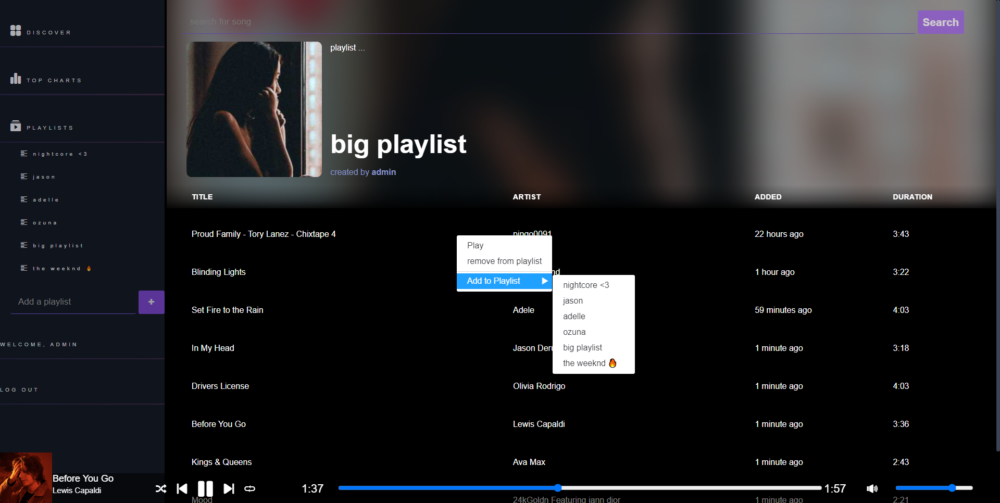

# Shopping-Site
This is a Music App, a place to listen to your music, catalog your favorites in playlists and discover new music popular around you. 

## Screenshot

| | |
|:-------------------------:|:-------------------------:|   
|  |  |
| |


<!--  -->

### Installation
The react music app demo on heroku over [here](https://music-app-10.herokuapp.com/discover)

or clone it:
```sh
$ git clone https://github.com/sabona10/music-app.git
$ cd music-app
$ npm install
$ npm run build
$ npm start
$ nodemon
```

and it will be at localhost:3000

[Trello Planning](https://trello.com/b/B18kBVoh/music-app)

### Tech

This site is created using:

* JS - Node js
* APIs - Mongoose database
* Expressjs - for the framework
* Dependencies - youtube-music-api, ReactPlayer
* HTML, CSS - duh!

### Next Steps

 - Add Albums, Artists, searches
 - Make the styling better
 - Add a queue of your music
 - Ability to share your playlist with others
 - More detail on the model of songs, now its very basic
 - download?!
